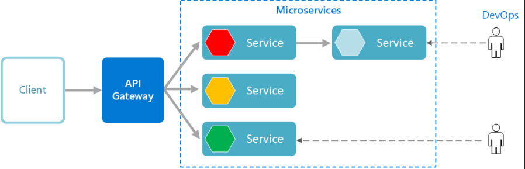
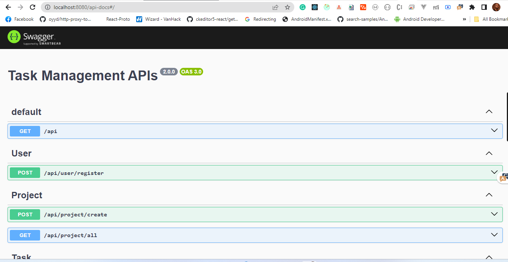

# Task-Management-System

This project is a [monorepo](https://monorepo.tools/) containing a REST API gateway with [RabbitMq](https://www.rabbitmq.com/) back-end microservices all written using the NestJS Framework and TypeScript. This project is mainly used for a simple task management purposes only.

## Architecture Overview

The REST API acts as a gateway/proxy for the different microservices it exposes. The controllers of the REST API make calls to the underlying microservices in the back-end. The called microservice then handles the request to connect to databases or any other service it needs to serve requests.

### Diagram

A diagram of the architecture is shown below.




## Design Patterns

This architecture implements the following Microservice Design Patterns:

1. [Microservice Architecture](https://microservices.io/patterns/microservices.html)
2. [API Gateway](https://microservices.io/patterns/apigateway.html)
3. [Database for persistence](https://microservices.io/patterns/data/database-per-service.html)

## Layers

### API Layer

[NestJS + Express](https://nestjs.com/) acts as the API Layer for the architecture. It takes care of listening for client requests and calling the appropriate back-end microservice to fulfill them.

### Microservice Layer

[RabbitMq](https://www.rabbitmq.com/) was chosen as the framework to perform the microservices. NestJS is still the framework used to create the rmq Microservices.

### Persistence Layer

PostgreSQL is used as the database and Typeorm is used as the Object-Relational Mapper (ORM).

## Deployment

Deployment is done with containers in mind. A Docker Compose file along with Dockerfiles for each project are given to run the whole thing on any machine.

## Project Structure


```
Task-Management-System
├── api-gateway
│   └── src
│       ├── applications
|       │   └──assets
│       │      ├── dtos
│       │      ├── enum
│       │      ├── interface
│       │      └── response
│       ├── exceptions
│       └── microservices
│           ├── user
│           └── task   
├── notification-microservice
│    └── src
│       ├── applications
|       │   ├── assets
│       │   │   ├── dtos
│       │   │   ├── enum
│       │   │   ├── interface
│       │   │   └── response
│       │   └── templates
│       └── domain 
├── task-microservices
│    └── src
│       ├── applications
|       │   ├── assets
│       │   │    ├── dtos
│       │   │    ├── enum
│       │   │    ├── interface
│       │   │    └── response
│       │   ├── project
│       │   └── task
│       ├── domain
│       └── shared
├── user-microservices
│    └── src
│       ├── applications
|       │   └── assets
│       │       ├── config 
│       │       ├── dtos
│       │       ├── enum
│       │       ├── interface
│       │       └── response
│       └── domain
└── ...
```

### Project Organization

1. `api-gateway` - This directory consists of the API Gateway project. All code relating to the API Gateway resides here.

2. `notification-microservice` - This directory consists of all files relating to notification. This package uses the mailer component of the nestjs framework to send emails to users.

3. `task-microservices` - This directory consists of all microservice task/project implementation.

4. `application/assets` - The assets directory is found in each of the Microservices packages. It contains all the enum, interface, response package which are applied to the application

5. `(any)microservices/domain` - The domain directory is found in each of the microservices project. It contains the model of project.

6. `(any)microservice/application` - The application directory contains the service/controller for the microservice functionalities
## How to Run

1. Must have 
- [Node.js](https://nodejs.org/en/) - v18 Recommended
- [Docker](https://docs.docker.com/get-docker/) - latest
- [Docker Compose](https://docs.docker.com/compose/install/) - latest

2. Create a `.env` file following the example of `.env.example` file in each of the microservice and the root project then

3. Once the step 2 is achieved then on your Terminal, go into the project's root folder (`cd /project/root/folder`) and execute `docker-compose up`.

4. Once the step 3 is done, the API Gateway will listening on [http://localhost](http://localhost:{yourPort})

5. To test the API, head to the Swagger UI running at [http://localhost:{port}/api-docs](http://localhost:{port}/api-docs)

## Roadmap



### General

- [ ] Use RxJS Observables instead of Promises

### API Gateway

- [ ] Add authentication
- [ ] Add event triggers
- [ ] Add request/input data validation
- [ ] Improve error handling

### Microservices

- [ ] Event driving
- [ ] Add caching
- [ ] Improve error handling